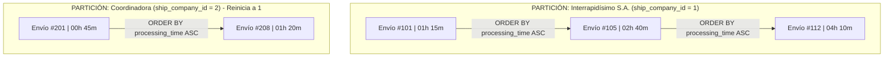

# Taller — Window Functions en PostgreSQL
Universidad de Pamplona  
Facultad de Ingenierías y Arquitectura  
Ingeniería de Sistemas  
Bases de Datos II  
2026-2

Estudiante:   
**Nombre:** Arley Ruben Martinez Mendoza  
**Fecha:** 29 de septiembre de 2026
[Repositorio de GitHub - BD2](https://github.com/Arley76/BD2)

## Ejercicio 1. ROW_NUMBER — Historial de compras por cliente

### a. Consulta por cada orden de pay.orders
```sql
SELECT 
    T2.name AS customer_name,
    T1.id AS order_id,
    T1.order_date,
    ROW_NUMBER() OVER (
        PARTITION BY T1.customer_id_number 
        ORDER BY T1.order_date ASC, T1.id ASC
    ) AS nro_orden
FROM pay.orders T1
INNER JOIN cs.customers T2 
    ON T1.customer_id_number = T2.id_number;
```

### b. CTE y filtro
```sql
WITH customer_orders AS (
    SELECT 
        T2.name AS customer_name,
        T1.id AS order_id,
        T1.order_date,
        ROW_NUMBER() OVER (
            PARTITION BY T1.customer_id_number 
            ORDER BY T1.order_date ASC, T1.id ASC
        ) AS nro_orden
    FROM pay.orders T1
    INNER JOIN cs.customers T2 
        ON T1.customer_id_number = T2.id_number
)
SELECT 
    customer_name,
    order_id,
    order_date,
    nro_orden
FROM customer_orders
WHERE nro_orden = 1;
```

### c. Análisis  
Las funciones de ventana como ROW_NUMBER() se procesan al final del flujo de SQL, después del WHERE, GROUP BY y HAVING. Por eso, PostgreSQL no permite evaluarlas dentro del WHERE y genera un error de sintaxis (ERROR: window functions are not allowed in WHERE).

## Ejercicio 2. RANK y DENSE_RANK — Empresas de envío por volumen.
### a. consulta sobre ship.shipment_orders y ship.ship_company
```sql
SELECT 
    T2.name AS company_name,
    COUNT(T1.id) AS total_shipments,
    RANK() OVER (ORDER BY COUNT(T1.id) DESC) AS rank_normal,
    DENSE_RANK() OVER (ORDER BY COUNT(T1.id) DESC) AS rank_dense
FROM ship.shipment_orders T1
INNER JOIN ship.ship_company T2 
    ON T1.ship_company_id = T2.id
GROUP BY T2.id, T2.name
ORDER BY total_shipments DESC;
```

### b. Identificación y análisis de empates
Resultado actual: No hubo empates en los resultados (van de 12,256 a 11,977 envíos). Por eso, RANK() y DENSE_RANK() generaron exactamente la misma secuencia del 1 al 10.   

Si hubiera un empate en el puesto 3:

RANK() dejaría un hueco y saltaría al puesto 5 para la siguiente empresa (cuenta competidores superados).

DENSE_RANK() mantendría la secuencia y asignaría el puesto 4.

### c. Modificacion de consulta
```sql
SELECT 
    T2.name AS company_name,
    COUNT(T1.id) AS total_shipments,
    RANK() OVER (ORDER BY COUNT(T1.id) DESC) AS rank_normal,
    DENSE_RANK() OVER (ORDER BY COUNT(T1.id) DESC) AS rank_dense,
    ROUND((COUNT(T1.id) * 100.0 / SUM(COUNT(T1.id)) OVER ()), 2) AS pct_of_total
FROM ship.shipment_orders T1
INNER JOIN ship.ship_company T2 
    ON T1.ship_company_id = T2.id
GROUP BY T2.id, T2.name
ORDER BY total_shipments DESC;
```

### d. Criterio de uso

Usar RANK(): Cuando el puesto representa una posición absoluta y penaliza a los siguientes por los empates previos.  

Ejemplo: Premios o incentivos a los 3 primeros. Si hay un empate en el 2.º lugar, el siguiente es el 4.º mejor en rendimiento real, por lo que no debe recibir premio de 3.  

Usar DENSE_RANK() (Sin saltos): Cuando se clasifican elementos por niveles o categorías continuas.  

Ejemplo: Categorización por Niveles de Servicio (Nivel 1, Nivel 2, Nivel 3). Garantiza que no se salten niveles en la escala operativa.   

## Ejercicio 3. SUM OVER sin partición - Participación en el ingreso total

### a. consulta sobre pay.order_items y ctg.products
```sql

SELECT 
    T2.name AS product_name,
    SUM(T2.cop_price * T1.quantity) AS total_revenue_cop,
    SUM(SUM(T2.cop_price * T1.quantity)) OVER () AS grand_total,
    ROUND(
        (SUM(T2.cop_price * T1.quantity) * 100.0 / SUM(SUM(T2.cop_price * T1.quantity)) OVER ()), 
        2
    ) AS pct_of_total,
    ROUND(
        (SUM(SUM(T2.cop_price * T1.quantity)) OVER (ORDER BY SUM(T2.cop_price * T1.quantity) DESC) * 100.0 
        / SUM(SUM(T2.cop_price * T1.quantity)) OVER ()), 
        2
    ) AS cumulative_pct
FROM pay.order_items T1
INNER JOIN ctg.products T2 
    ON T1.product_id = T2.id
GROUP BY T2.id, T2.name
ORDER BY total_revenue_cop DESC;
```


### b. Verificacion columna grand_total  
La columna grand_total muestra exactamente el mismo valor en todas las filas de la consulta. Esto sucede porque la cláusula OVER () se encuentra totalmente vacía, sin PARTITION BY ni ORDER BY.
### c. Modificacion de consulta
Al agregar ORDER BY SUM(T2.cop_price * T1.quantity) DESC dentro de la ventana de la columna cumulative_pct, PostgreSQL calcula una suma acumulada progresiva fila por fila en orden descendente de ventas, dividiendo cada acumulado entre el grand_total global para obtener la participación porcentual acumulada.


## Ejercicio 4. SUM OVER con ORDER BY - Ingreso acumulado mes a mes

### a. y b. Consulta de ventas acumuladas por mes y porcentaje global
```sql

WITH monthly_sales AS (
    SELECT 
        DATE_TRUNC('month', T1.order_date) AS month,
        SUM(T1.total) AS monthly_revenue
    FROM pay.orders T1
    GROUP BY DATE_TRUNC('month', T1.order_date)
)
SELECT 
    month,
    monthly_revenue,
    SUM(monthly_revenue) OVER (ORDER BY month ASC) AS cumulative_revenue,
    ROUND(
        (SUM(monthly_revenue) OVER (ORDER BY month ASC) * 100.0 / SUM(monthly_revenue) OVER ()), 
        2
    ) AS pct_of_total
FROM monthly_sales
ORDER BY month ASC;
```

### c. Análisis escrito y tabla de flujo acumulado
Cuando se incluye ORDER BY dentro del OVER() de una función de agregación como SUM(), PostgreSQL aplica de forma implícita el marco de ventana BETWEEN UNBOUNDED PRECEDING AND CURRENT ROW. Esto significa que el acumulado de la fila n incluye su propio valor más la suma de todas las filas previas, convirtiéndose directamente en la base del valor acumulado para la fila n+1.

| Mes (`month`) | Ventas del Mes (`monthly_revenue`) | Acumulado (`cumulative_revenue`) | Flujo de Acumulación |
| :--- | :--- | :--- | :--- |
| **Fila 1 (2025-12)** | $V_1$ | $V_1$ | Base inicial |
| **Fila 2 (2026-01)** | $V_2$ | $V_1 + V_2$ | $\downarrow$ *(Base anterior $V_1$ + $V_2$)* |
| **Fila 3 (2026-02)** | $V_3$ | $V_1 + V_2 + V_3$ | $\downarrow$ *(Base anterior $(V_1+V_2)$ + $V_3$)* |
| **Fila 4 (2026-03)** | $V_4$ | $V_1 + V_2 + V_3 + V_4$ | $\downarrow$ *(Base anterior $(V_1+V_2+V_3)$ + $V_4$)* |

### d. Experimento con PARTITION BY payment_method_id
```sql

WITH monthly_sales AS (
    SELECT 
        DATE_TRUNC('month', T1.order_date) AS month,
        T1.payment_method_id,
        SUM(T1.total) AS monthly_revenue
    FROM pay.orders T1
    GROUP BY DATE_TRUNC('month', T1.order_date), T1.payment_method_id
)
SELECT 
    month,
    payment_method_id,
    monthly_revenue,
    SUM(monthly_revenue) OVER (
        PARTITION BY payment_method_id 
        ORDER BY month ASC
    ) AS cumulative_revenue
FROM monthly_sales
ORDER BY payment_method_id, month ASC;
```
Al incorporar PARTITION BY payment_method_id, el conjunto de datos se fragmenta en grupos independientes por cada método de pago. El cálculo del acumulado mensual opera de forma aislada dentro de cada grupo y reinicia su contador en 0 cada vez que la consulta pasa a evaluar un nuevo método de pago


## Ejercicio 5. LAG - Variación mensual de ventas
### a. Consulta con LAG, diferencia y variación porcentual
```sql

WITH monthly_sales AS (
    SELECT 
        DATE_TRUNC('month', T1.order_date) AS month,
        SUM(T1.total) AS sales
    FROM pay.orders T1
    GROUP BY DATE_TRUNC('month', T1.order_date)
)
SELECT 
    month,
    sales AS current_month_sales,
    COALESCE(LAG(sales) OVER (ORDER BY month ASC), 0) AS prev_month_sales,
    sales - COALESCE(LAG(sales) OVER (ORDER BY month ASC), 0) AS difference,
    ROUND(
        CASE 
            WHEN LAG(sales) OVER (ORDER BY month ASC) IS NULL THEN 0.00
            ELSE ((sales - LAG(sales) OVER (ORDER BY month ASC)) * 100.0 / LAG(sales) OVER (ORDER BY month ASC))
        END, 
        2
    ) AS pct_change
FROM monthly_sales
ORDER BY month ASC;
```


### b. Identificación de meses con variaciones extremas
Mes con mayor caída porcentual: 2026-09-01 con un porcentaje de variación del -100.00% (caída de -638,093,105,662.50 en ventas).     
Mes con mayor crecimiento porcentual: 2026-02-01 con un incremento del 166.78% (aumento de 546,796,830,000.00 en ventas respecto al mes anterior)

### c. Variación respecto a dos meses atrás
```sql
WITH monthly_sales AS (
    SELECT 
        DATE_TRUNC('month', T1.order_date) AS month,
        SUM(T1.total) AS sales
    FROM pay.orders T1
    GROUP BY DATE_TRUNC('month', T1.order_date)
)
SELECT 
    month,
    sales AS current_month_sales,
    COALESCE(LAG(sales) OVER (ORDER BY month ASC), 0) AS prev_month_sales,
    COALESCE(LAG(sales, 2) OVER (ORDER BY month ASC), 0) AS sales_2months_ago,
    sales - COALESCE(LAG(sales) OVER (ORDER BY month ASC), 0) AS difference,
    ROUND(
        CASE 
            WHEN LAG(sales) OVER (ORDER BY month ASC) IS NULL THEN 0.00
            ELSE ((sales - LAG(sales) OVER (ORDER BY month ASC)) * 100.0 / LAG(sales) OVER (ORDER BY month ASC))
        END, 
        2
    ) AS pct_change
FROM monthly_sales
ORDER BY month ASC;

```

### d. Análisis escrito y comparación con Self-JOIN
```sql
WITH monthly_sales AS (
    SELECT 
        DATE_TRUNC('month', order_date) AS month,
        SUM(total) AS sales
    FROM pay.orders
    GROUP BY DATE_TRUNC('month', order_date)
)
SELECT 
    T1.month AS month,
    T1.sales AS current_month_sales,
    COALESCE(T2.sales, 0) AS prev_month_sales,
    T1.sales - COALESCE(T2.sales, 0) AS difference
FROM monthly_sales T1
LEFT JOIN monthly_sales T2 
    ON T2.month = T1.month - INTERVAL '1 month'
ORDER BY T1.month ASC;
```

Antes de las Window Functions, comparar filas consecutivas exigía realizar un LEFT JOIN de la tabla contra sí misma calculando un desfase manual en la condición de unión (ON T2.month = T1.month - INTERVAL '1 month').    
 La versión con LAG() resuelve el cálculo de forma directa en 1 sola línea dentro del SELECT sin duplicar accesos ni requerir lógica de unión.    
 La versión con Self-JOIN requiere duplicar alias de tablas, escribir cláusulas de unión complejas y requiere alrededor de 8 a 10 líneas adicionales de código, siendo además propensa a fallos si existen meses en los que no hubo ventas.

## Ejercicio 6. 
### a. Consulta con LEAD y cálculo de días entre envíos
```sql
SELECT 
    T1.ship_company_id,
    T1.id AS order_id,
    T1.created_at,
    LEAD(T1.created_at) OVER (
        PARTITION BY T1.ship_company_id 
        ORDER BY T1.created_at ASC, T1.id ASC
    ) AS next_shipment_date,
    LEAD(T1.created_at) OVER (
        PARTITION BY T1.ship_company_id 
        ORDER BY T1.created_at ASC, T1.id ASC
    ) - T1.created_at AS days_until_next
FROM ship.shipment_orders T1;

```

### b. Promedio de días entre envíos consecutivos por empresa
```sql
WITH shipment_intervals AS (
    SELECT 
        T1.ship_company_id,
        T2.name AS company_name,
        T1.created_at,
        LEAD(T1.created_at) OVER (
            PARTITION BY T1.ship_company_id 
            ORDER BY T1.created_at ASC, T1.id ASC
        ) - T1.created_at AS interval_days
    FROM ship.shipment_orders T1
    INNER JOIN ship.ship_company T2 
        ON T1.ship_company_id = T2.id
)
SELECT 
    company_name,
    ROUND(AVG(EXTRACT(DAY FROM interval_days) + EXTRACT(HOUR FROM interval_days)/24.0), 2) AS avg_days_between_shipments
FROM shipment_intervals
WHERE interval_days IS NOT NULL
GROUP BY ship_company_id, company_name
ORDER BY avg_days_between_shipments ASC;
```

### c. Análisis escrito y esquema con LEAD
La función LEAD() inspecciona el conjunto de datos ordenado mirando en dirección al futuro (filas posteriores). En cada fila toma el valor de la columna indicada para la fila siguiente dentro de la misma partición. Cuando se procesa el último envío registrado de una empresa, como no existe un envío posterior, la función devuelve un valor NULL

PARTICIÓN: Empresa A (ship_company_id = 1)
  -------------------------------------------------------------------------------------
  Fila 1 | created_at: 2026-01-10 08:00:00 | LEAD devuelve: 2026-01-12 10:00:00
          |                                  └───> Días de diferencia: 2.08 días
  -------------------------------------------------------------------------------------
  Fila 2 | created_at: 2026-01-12 10:00:00 | LEAD devuelve: 2026-01-15 14:00:00
          |                                  └───> Días de diferencia: 3.16 días
  -------------------------------------------------------------------------------------
  Fila 3 | created_at: 2026-01-15 14:00:00 | LEAD devuelve: NULL (no hay fila posterior)


### d. Comparación LAG vs LEAD
```sql
-- LEAD (orden ASC):
SELECT 
    T1.ship_company_id,
    T1.created_at,
    LEAD(T1.created_at) OVER (PARTITION BY T1.ship_company_id ORDER BY T1.created_at ASC, T1.id ASC) AS adjacent_shipment
FROM ship.shipment_orders T1;

-- LAG (orden DESC):
SELECT 
    T1.ship_company_id,
    T1.created_at,
    LAG(T1.created_at) OVER (PARTITION BY T1.ship_company_id ORDER BY T1.created_at DESC, T1.id DESC) AS adjacent_shipment
FROM ship.shipment_orders T1;
```
Ambas versiones permiten consultar la fecha del envío adyacente invirtiendo el criterio de ordenación (ORDER BY).   En la versión con LEAD() (ORDER BY ASC), la navegación va hacia adelante y el valor NULL aparece en la última fila de cada partición.   
En la versión con LAG() (ORDER BY DESC), la ordenación descendente hace que la fila anterior corresponda a la fecha futura en el tiempo real, produciendo el valor NULL en la primera fila de cada partición.


## Ejercicio 7. Patrón Top N - Productos más vendidos por categoría
### a. Top 3 productos más vendidos por categoría
```sql
WITH ranked_products AS (
    SELECT 
        T3.name AS category_name,
        T2.name AS product_name,
        SUM(T1.quantity) AS total_units,
        RANK() OVER (
            PARTITION BY T3.id 
            ORDER BY SUM(T1.quantity) DESC
        ) AS ranking
    FROM pay.order_items T1
    INNER JOIN ctg.products T2 
        ON T1.product_id = T2.id
    INNER JOIN ctg.categories T3 
        ON T2.category_id = T3.id
    GROUP BY T3.id, T3.name, T2.id, T2.name
)
SELECT 
    category_name,
    product_name,
    total_units,
    ranking
FROM ranked_products
WHERE ranking <= 3
ORDER BY category_name, ranking ASC;
```

### b. Verificación del número de filas por categoría
Si alguna categoría presenta más de 3 filas en el resultado al filtrar por ranking <= 3, se debe a que existen empates en la cantidad total de unidades vendidas (total_units) en el tercer puesto. La función RANK() asigna exactamente la misma posición a los registros empatados, provocando que más de tres productos cumplan con la condición <= 3
### c. Modificación para empates usando DENSE_RANK()
```sql
WITH ranked_products AS (
    SELECT 
        T3.name AS category_name,
        T2.name AS product_name,
        SUM(T1.quantity) AS total_units,
        DENSE_RANK() OVER (
            PARTITION BY T3.id 
            ORDER BY SUM(T1.quantity) DESC
        ) AS ranking
    FROM pay.order_items T1
    INNER JOIN ctg.products T2 
        ON T1.product_id = T2.id
    INNER JOIN ctg.categories T3 
        ON T2.category_id = T3.id
    GROUP BY T3.id, T3.name, T2.id, T2.name
)
SELECT 
    category_name,
    product_name,
    total_units,
    ranking
FROM ranked_products
WHERE ranking <= 3
ORDER BY category_name, ranking ASC;
```
Para garantizar que ante un empate en la tercera posición se incluyan todos los productos empatados sin perder el orden secuencial de los siguientes puestos, se utiliza DENSE_RANK().

### d. Generalización para Top N
```sql
WITH ranked_products AS (
    SELECT 
        T3.name AS category_name,
        T2.name AS product_name,
        SUM(T1.quantity) AS total_units,
        DENSE_RANK() OVER (
            PARTITION BY T3.id 
            ORDER BY SUM(T1.quantity) DESC
        ) AS ranking
    FROM pay.order_items T1
    INNER JOIN ctg.products T2 
        ON T1.product_id = T2.id
    INNER JOIN ctg.categories T3 
        ON T2.category_id = T3.id
    GROUP BY T3.id, T3.name, T2.id, T2.name
)
SELECT 
    category_name,
    product_name,
    total_units,
    ranking
FROM ranked_products
WHERE ranking <= 5 
ORDER BY category_name, ranking ASC;
```


## Ejercicio 8. Segmentación de clientes — Combinando funciones
### a. y d. Clasificación de clientes y filtrado VIP
```sql
WITH customer_stats AS (
    SELECT 
        T1.customer_id_number,
        SUM(T1.total) AS total_spent,
        COUNT(DISTINCT T1.id) AS total_orders,
        MIN(T1.order_date) AS first_purchase,
        MAX(T1.order_date) AS last_purchase,
        ROW_NUMBER() OVER (ORDER BY SUM(T1.total) DESC) AS global_rank
    FROM pay.orders T1
    GROUP BY T1.customer_id_number
)
SELECT 
    T2.id_number,
    T2.name AS customer_name,
    COALESCE(T1.total_spent, 0) AS total_spent,
    COALESCE(T1.total_orders, 0) AS total_orders,
    T1.first_purchase,
    T1.last_purchase,
    T1.global_rank,
    CASE 
        WHEN T1.total_spent > 10000000 THEN 'VIP'
        WHEN T1.total_spent > 3000000 THEN 'Regular'
        WHEN T1.total_orders >= 1 THEN 'New'
        ELSE 'Inactive'
    END AS segment
FROM cs.customers T2
LEFT JOIN customer_stats T1 
    ON T2.id_number = T1.customer_id_number;
```

### b. Distribución de clientes por segmento
```sql
WITH customer_stats AS (
    SELECT 
        T1.customer_id_number,
        SUM(T1.total) AS total_spent,
        COUNT(DISTINCT T1.id) AS total_orders
    FROM pay.orders T1
    GROUP BY T1.customer_id_number
),
segmented_customers AS (
    SELECT 
        T2.id_number,
        CASE 
            WHEN T1.total_spent > 10000000 THEN 'VIP'
            WHEN T1.total_spent > 3000000 THEN 'Regular'
            WHEN T1.total_orders >= 1 THEN 'New'
            ELSE 'Inactive'
        END AS segment
    FROM cs.customers T2
    LEFT JOIN customer_stats T1 
        ON T2.id_number = T1.customer_id_number
)
SELECT 
    segment,
    COUNT(*) AS total_customers
FROM segmented_customers
GROUP BY segment
ORDER BY total_customers DESC;
```

### c. Diagrama de distribución de clientes
Segmento | Cantidad de Clientes (Distribución)
-----------+---------------------------------------------------  
       VIP | [||||||||||||||||||||||||||||||||||||||||]  
   Regular | [||||||||||||||||||||||||||||]  
       New | [||||||||||||||||||||||]  
  Inactive | [|||||]

## Ejercicio 9. Reporte integrador - La pregunta del jefe
### a. Consulta integradora para tres clientes específicos
```sql
WITH selected_customers AS (
    SELECT id_number, name AS customer_name 
    FROM cs.customers 
    LIMIT 3
),
customer_orders_ranked AS (
    SELECT 
        T1.customer_id_number,
        T1.order_date,
        T1.total,
        ROW_NUMBER() OVER (
            PARTITION BY T1.customer_id_number 
            ORDER BY T1.order_date ASC, T1.id ASC
        ) AS order_seq
    FROM pay.orders T1
    WHERE T1.customer_id_number IN (SELECT id_number FROM selected_customers)
),
customer_totals AS (
    SELECT 
        T1.customer_id_number,
        SUM(T1.total) OVER (PARTITION BY T1.customer_id_number) AS total_spent,
        COUNT(T1.id) OVER (PARTITION BY T1.customer_id_number) AS total_orders
    FROM pay.orders T1
    WHERE T1.customer_id_number IN (SELECT id_number FROM selected_customers)
),
monthly_customer_sales AS (
    SELECT 
        T1.customer_id_number,
        DATE_TRUNC('month', T1.order_date) AS month,
        SUM(T1.total) AS monthly_sales
    FROM pay.orders T1
    WHERE T1.customer_id_number IN (SELECT id_number FROM selected_customers)
    GROUP BY T1.customer_id_number, DATE_TRUNC('month', T1.order_date)
),
monthly_comparisons AS (
    SELECT 
        customer_id_number,
        month,
        monthly_sales AS current_month_sales,
        LAG(monthly_sales) OVER (
            PARTITION BY customer_id_number 
            ORDER BY month ASC
        ) AS prev_month_sales,
        ROW_NUMBER() OVER (
            PARTITION BY customer_id_number 
            ORDER BY month DESC
        ) AS month_recency_rank
    FROM monthly_customer_sales
)
SELECT DISTINCT
    T1.customer_name,
    T2.order_date AS first_order_date,
    T2.total AS first_order_total,
    T3.total_spent,
    T3.total_orders,
    COALESCE(T4.current_month_sales, 0) AS current_month_sales,
    COALESCE(T4.prev_month_sales, 0) AS prev_month_sales,
    COALESCE(T4.current_month_sales, 0) - COALESCE(T4.prev_month_sales, 0) AS difference
FROM selected_customers T1
INNER JOIN customer_orders_ranked T2 
    ON T1.id_number = T2.customer_id_number AND T2.order_seq = 1
INNER JOIN customer_totals T3 
    ON T1.id_number = T3.customer_id_number
INNER JOIN monthly_comparisons T4 
    ON T1.id_number = T4.customer_id_number AND T4.month_recency_rank = 1;
```

### b. Tabla de mapeo
| Pregunta del jefe | CTE | Función usada |
| :--- | :--- | :--- |
| **Primera orden por cliente** | `customer_orders_ranked` | `ROW_NUMBER() OVER (PARTITION BY customer_id_number ORDER BY order_date ASC)` |
| **Total gastado** | `customer_totals` | `SUM() OVER (PARTITION BY customer_id_number)` |
| **Este mes vs mes anterior** | `monthly_comparisons` | `LAG() OVER (PARTITION BY customer_id_number ORDER BY month ASC)` |
### c. Comparación de versiones (Con Window Functions vs Sin Window Functions)
```sql
SELECT 
    T1.name AS customer_name,
    T2.order_date AS first_order_date,
    T2.total AS first_order_total,
    (SELECT SUM(total) FROM pay.orders WHERE customer_id_number = T1.id_number) AS total_spent,
    (SELECT COUNT(*) FROM pay.orders WHERE customer_id_number = T1.id_number) AS total_orders,
    COALESCE(T3.current_sales, 0) AS current_month_sales,
    COALESCE(T4.prev_sales, 0) AS prev_month_sales,
    COALESCE(T3.current_sales, 0) - COALESCE(T4.prev_sales, 0) AS difference
FROM cs.customers T1
INNER JOIN pay.orders T2 ON T2.id = (
    SELECT id FROM pay.orders 
    WHERE customer_id_number = T1.id_number 
    ORDER BY order_date ASC, id ASC LIMIT 1
)
LEFT JOIN (
    SELECT customer_id_number, SUM(total) AS current_sales 
    FROM pay.orders 
    WHERE DATE_TRUNC('month', order_date) = '2026-03-01'
    GROUP BY customer_id_number
) T3 ON T1.id_number = T3.customer_id_number
LEFT JOIN (
    SELECT customer_id_number, SUM(total) AS prev_sales 
    FROM pay.orders 
    WHERE DATE_TRUNC('month', order_date) = '2026-02-01'
    GROUP BY customer_id_number
) T4 ON T1.id_number = T4.customer_id_number
WHERE T1.id_number IN (SELECT id_number FROM cs.customers LIMIT 3);
```

La versión sin Window Functions toma alrededor de 28 a 32 líneas con subconsultas fragmentadas y condicionales hardcodeados.  
La versión con Window Functions se estructura mediante CTEs limpias y reutilizables en 35 líneas, eliminando valores quemados en el código
### d. Análisis escrito de lecturas de tabla e impacto en rendimiento

En la versión sin Window Functions, la tabla pay.orders es leída al menos 5 veces independientes (dos subconsultas en el SELECT, una subconsulta en el JOIN de la primera orden y dos joins para los totales del mes actual y previo).  
En contraste, con Window Functions la tabla se lee una única vez por CTE, realizando operaciones de partición en memoria.   
Impacto a escala: Con 16.258 registros la diferencia es de milisegundos. Al escalar a 16.000.000 de registros, la versión sin Window Functions colapsará el servidor por la sobrecarga de Entrada/Salida (I/O) al hacer millones de escaneos, mientras que la versión con Window Functions ejecutará un único escaneo eficiente.
## Ejercicio 10. Diseño propio - Caso de uso libre
### a. Descripción del caso de uso
```sql
Análisis del tiempo transcurrido entre la creación de una orden de pago (pay.orders) y su despacho registrado en envíos (ship.shipment_orders), determinando para cada empresa transportista (ship.ship_company) cuáles han sido sus 3 envíos más rápidos.
```
### b. Selección de función y configuración

Función elegida: ROW_NUMBER().    
Justificación: Permite asignar una numeración consecutiva estricta para identificar los despachos con menor tiempo de procesamiento.  
PARTITION BY: T1.ship_company_id (para agrupar por cada empresa de envío).   
ORDER BY: (T1.created_at - T2.order_date) ASC (para ordenar del menor al mayor tiempo de despacho).   

### c. Consulta SQL
```sql
WITH dispatch_times AS (
    SELECT 
        T3.name AS company_name,
        T1.id AS shipment_id,
        T2.id AS order_id,
        T1.created_at - T2.order_date AS processing_time,
        ROW_NUMBER() OVER (
            PARTITION BY T1.ship_company_id 
            ORDER BY (T1.created_at - T2.order_date) ASC
        ) AS speed_rank
    FROM ship.shipment_orders T1
    INNER JOIN pay.orders T2 
        ON T1.order_id = T2.id
    INNER JOIN ship.ship_company T3 
        ON T1.ship_company_id = T3.id
)
SELECT 
    company_name,
    shipment_id,
    order_id,
    processing_time,
    speed_rank
FROM dispatch_times
WHERE speed_rank <= 3
ORDER BY company_name, speed_rank ASC;
```

### d. Diagrama de particiones

### e. Reflexión final
Para resolver este caso sin Window Functions, se habría tenido que agrupar la tabla en una subconsulta calculando el mínimo tiempo por empresa (MIN(...)), realizar un JOIN compuesto para recuperar los IDs correspondientes y aplicar lógica adicional para desempates.  
La Window Function simplifica radicalmente la solución, reduciendo la complejidad del código a la mitad y permitiendo obtener el Top 3 por grupo de forma directa y óptima.


